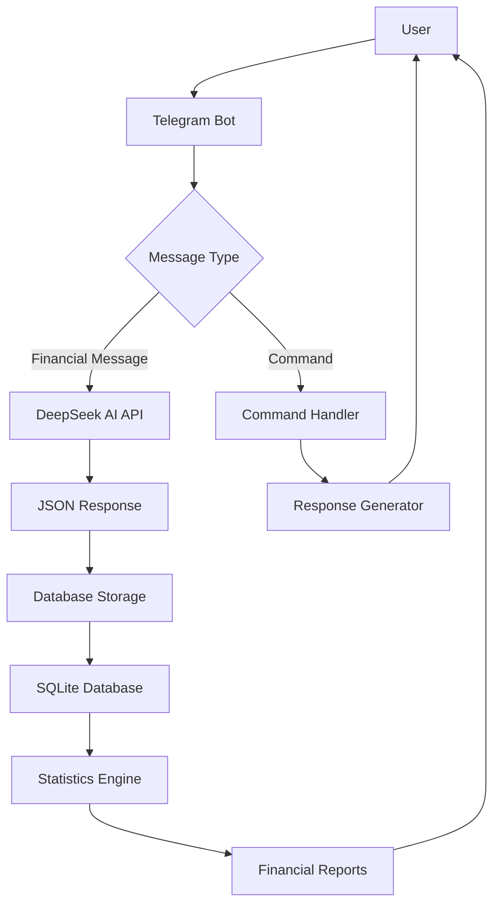

# Finner Bot Architecture

## Components

1. **Telegram Bot Interface**: Handles user interactions through Telegram
2. **Message Processor**: Determines if incoming messages are financial transactions or commands
3. **DeepSeek AI Integration**: Processes natural language financial messages and extracts structured data
4. **Database Layer**: Stores all financial transactions in SQLite
5. **Statistics Engine**: Calculates financial metrics and generates reports
6. **Command Handler**: Processes bot commands like /stats, /transactions

## Data Flow

1. User sends a message to the bot
2. Bot determines if it's a financial transaction or command
3. For financial messages:
   - Sent to DeepSeek AI for processing
   - AI returns structured JSON data
   - Data is validated and stored in database
   - Confirmation sent to user
4. For commands:
   - Appropriate handler processes the command
   - Data retrieved from database if needed
   - Response formatted and sent to user